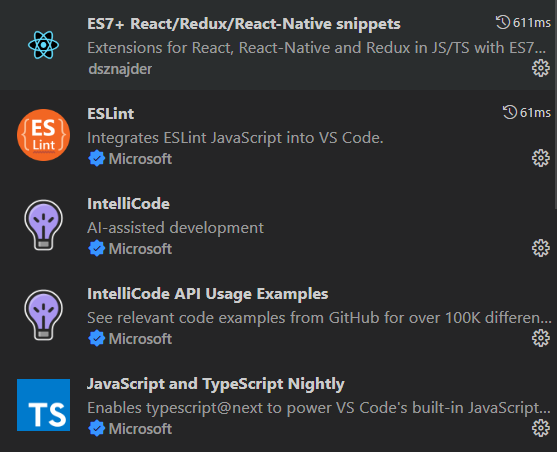
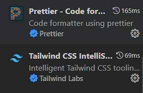

# **✨ Como executar**

**Para que esse projeto funcione corretamente, é preciso estar com o servidor rodando.**

> - Entre no projeto `cd admin-web`
> - Instale os pacotes com `npm install`.
> - Execute `npm start` para iniciar o servidor.
> - Para facilitar no seu desenvolvimento aconselho você a baixar as seguintes extensões:
>    
