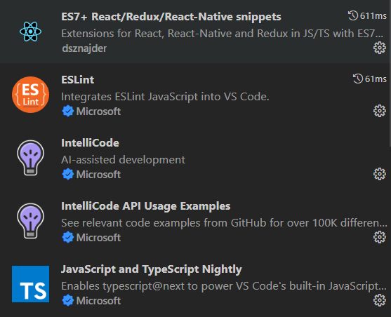
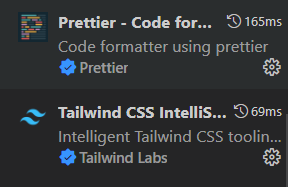

# **✨ Como executar**

**Para que esse projeto funcione corretamente, é preciso estar com o servidor rodando.**

> - Entre no projeto `cd portal-web`
> - Instale os pacotes com `npm install`.
> - Execute `npm start` para iniciar o servidor.
> - Para formatar arquivos com as configurações do Prettier, rode: `npx prettier --write .`
> - Para formatar arquivos com as configurações do ESLint, rode: `npx eslint .`
> - Para formatar diretórios com as configurações do ESLint, rode: `npx eslint --ext .js .`
> - Para facilitar no seu desenvolvimento aconselho você a baixar as seguintes extensões.
>    
